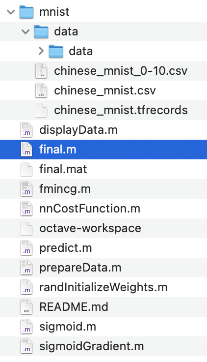

# Preparing the data
- Download the [Chinese MNIST](https://www.kaggle.com/datasets/gpreda/chinese-mnist) from Kaggle.
- Delete the `100`, `1000`, `10000` and `100000000` data rows in `chinese_mnist.csv` and save it as `chinese_mnist_0-10.csv`.
- Run the `prepareData.m` to generate the `final.mat`.
- The folder structure should be like this.  
.

# Start the prediction
- Run `final.m`.